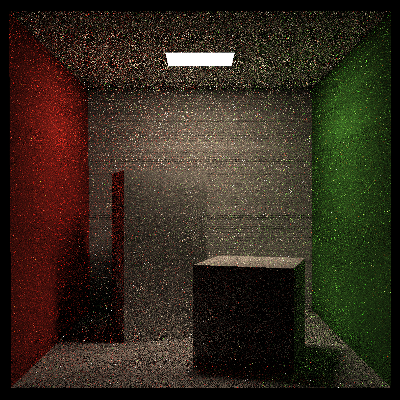
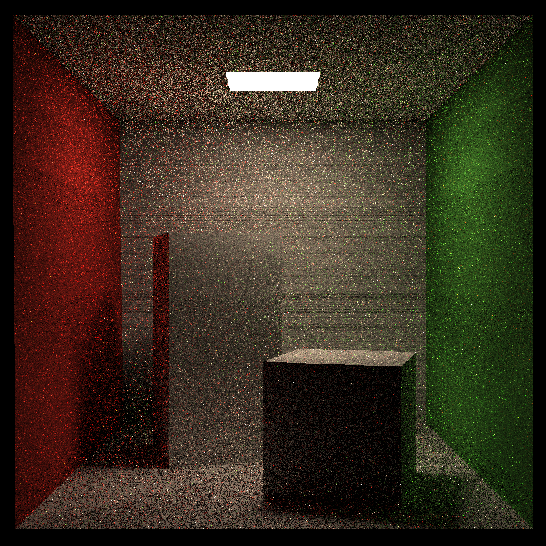
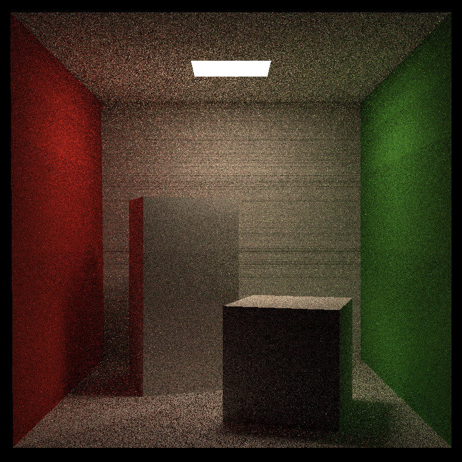
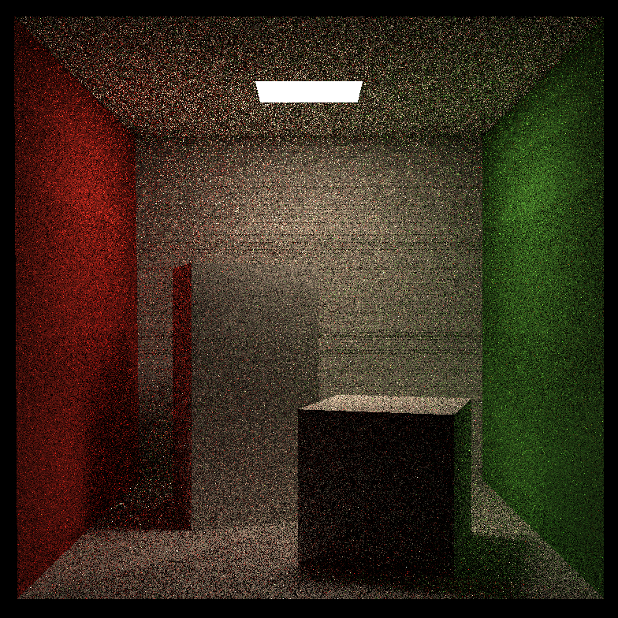
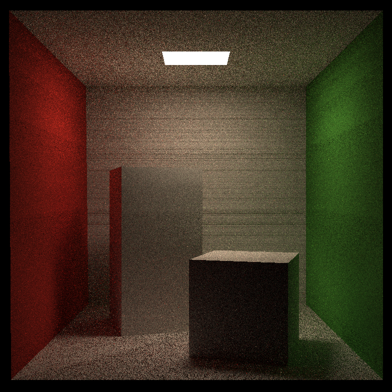

# Games101

学习笔记在NOTE文件夹中

## Assignment 3

## Assignment 4

循环边界写错，导致段错误，debug半小时，引以为戒

## Assignment 5

为什么我的地板有问题

## Assignment 6

`Intersection`类的成员`distance`可以用时间`t`表示

## Assignment 7

### 踩到的坑

- 与$x-y$平面平行的三角形没有被渲染。因为求交点的算法中没有考虑$t_{enter}==t_{exit}$的情况
- 光源全黑，shade渲染时需要对指向光源的`primary ray`进行特殊处理
- 渲染结果中有水平横线 数值问题

### 心得

这种包含大量循环的程序用通常的情况难以debug，可以在降低采样数的情况下（调整`SSP`和`RussianRoulette`）改变关键代码，对比渲染结果的改变推测BUG的原因

### RussianRoulette==0.2 SSP = 16

### RussianRoulette==0.4 SSP = 16

### RussianRoulette==0.8 SSP = 16

### RussianRoulette==0.8 SSP = 4

### RussianRoulette==0.8 SSP = 8

### RussianRoulette==0.8 SSP = 32

